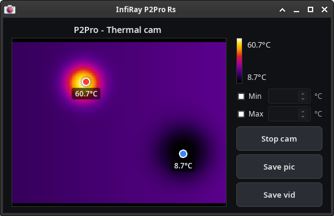

# InfiRay P2Pro Thermal Camera Viewer

A minimal InfiRay P2Pro thermal camera viewer.



Features:

- Live false-color ("ironbow"-style) view of the InfiRay P2Pro thermal camera.
- A temperature color-scale legend next to the image.
- Markers for the current frame's coldest and hottest pixels, with their temperature labels.
- Automatic scaling: the color range always stretches to the current frame's min/max temperature.
- Manual scaling: allows the user to set a fixed temperature range for the color mapping.
- Zoom and pan of the live thermal image.
- Saving of the thermal image to a PNG file.
- Recording of the thermal video to an AVI video file.

## Operating System Support

- **Linux**
- **Android** (9 or later)

## How it talks to the camera

The P2Pro shows up as a standard UVC webcam and requests raw `YUYV` frames at 256x384.
The top half of that buffer is a normal 8-bit preview (ignored here) and the bottom half is actually raw 16-bit temperature samples packed into what looks like YUYV bytes.

How that YUYV stream is obtained depends on the platform:

- **Linux desktop**: opened directly via Video4Linux2.
- **Android**: Android does not expose a V4L2. Instead, the app drives the P2Pro's USB Video Class protocol itself.

## Running on Linux

First install [Rust](https://www.rust-lang.org/tools/install) and then build the app:

```sh
desktop-build-linux.sh
```

Then run the built executable:

```sh
./p2pro-rs-desktop-linux-x64
```

The app will probe `/dev/video*` for a P2Pro camera and open the first one it finds.

If you want to specify a particular device, you can pass it as the first argument:

```sh
./p2pro-rs-desktop-linux-x64 /dev/video2
```

For testing without a camera attached, the `--demo` option enables a dummy camera that generates an animated test picture:

```sh
./p2pro-rs-desktop-linux-x64 --demo
```

There is no need to install the app.
You can just copy the p2pro-rs binary to a convenient location and run it from there.

But if you want to install it to `/opt`, you can do it with:

```sh
./desktop-install-linux.sh
```

## Running on Android

If you do not want to build the app yourself, you can download the latest APK from
[Github CI](https://github.com/mbuesch/p2pro-rs/actions/workflows/ci.yml).
Pick the latest successful run from the `main` branch and download the `p2pro-rs-android-app-aarch64` artifact.
The provided APK is meant for ADB (USB) sideloading.
Proceed with `android-install.sh` from that artifact (see below) for sideloading.

Note that the APK is signed with a debug key and is only provided on a best-effort basis.
It should work properly, but it's not regularly tested.
If there are problems with the pre-built APK, please file an issue.

### If you want to build the app yourself (recommended), follow these steps

First install [Rust](https://www.rust-lang.org/tools/install) on the build PC (Linux).

Before running the Android build script, ensure you have the Android NDK and SDK installed and properly configured on the build PC.
The easiest way to get them is to install
[Android Studio](https://developer.android.com/studio),
and use the
[Dioxus install tutorial](https://dioxuslabs.com/learn/0.7/guides/platforms/mobile).
For the build script to work, you need to set the some environment variables to point to your Android NDK and SDK installations.

```sh
# Set this to the path of your Android SDK installation.
export ANDROID_HOME="$HOME/Android/Sdk"

# Set this to the path of your Android NDK installation.
# Adjust the VERSION part to match the installed NDK version.
export ANDROID_NDK_HOME="$HOME/Android/Sdk/ndk/VERSION"

# Add Android SDK platform-tools to PATH for ADB access.
export PATH="$HOME/Android/Sdk/platform-tools/:$PATH"
```

On the build PC (Linux) run the provided script to build the Android packages:

```sh
./android-build.sh
```

Install the generated APK on your Android device (via ADB sideloading).
Plug in your Android device, ensure Developer Mode, USB debugging and Sideloading are enabled, and run:

```sh
./android-install.sh
```

## Video format

The application always records to lossless HuffYUV AVI format.
This creates rather large video files compared to lossy formats, but preserves the full quality of the thermal video.

If you want to reduce file size and re-encode the video to a lossy format, you can use video editing or conversion tools such as FFmpeg:

```sh
# H.264 (MP4) - most compatible, great quality/size
ffmpeg -i input.avi -c:v libx264 -crf 18 -preset slow -c:a aac -b:a 192k output.mp4

# H.265/HEVC (MP4) - better compression than H.264 at same quality
ffmpeg -i input.avi -c:v libx265 -crf 20 -preset slow -c:a aac -b:a 192k output.mp4

# VP9 (WebM) - royalty-free, good for web
ffmpeg -i input.avi -c:v libvpx-vp9 -crf 30 -b:v 0 -c:a libopus -b:a 160k output.webm

# AV1 (MP4/WebM) — best compression, but slowest to encode
ffmpeg -i input.avi -c:v libsvtav1 -crf 30 -preset 6 -c:a libopus -b:a 160k output.mp4
```

## License

This app has been developed with use of AI agent assistance and with manual software development methods.

Copyright (c) 2026 Michael Büsch

This project is licensed under the MIT License. See the [LICENSE](LICENSE) file for details.

This program has initially been AI-derived from the p2pro-live Python application.
Copyright of the original p2pro-live application:
Copyright (c) 2024 Klaus Schwarzburg
